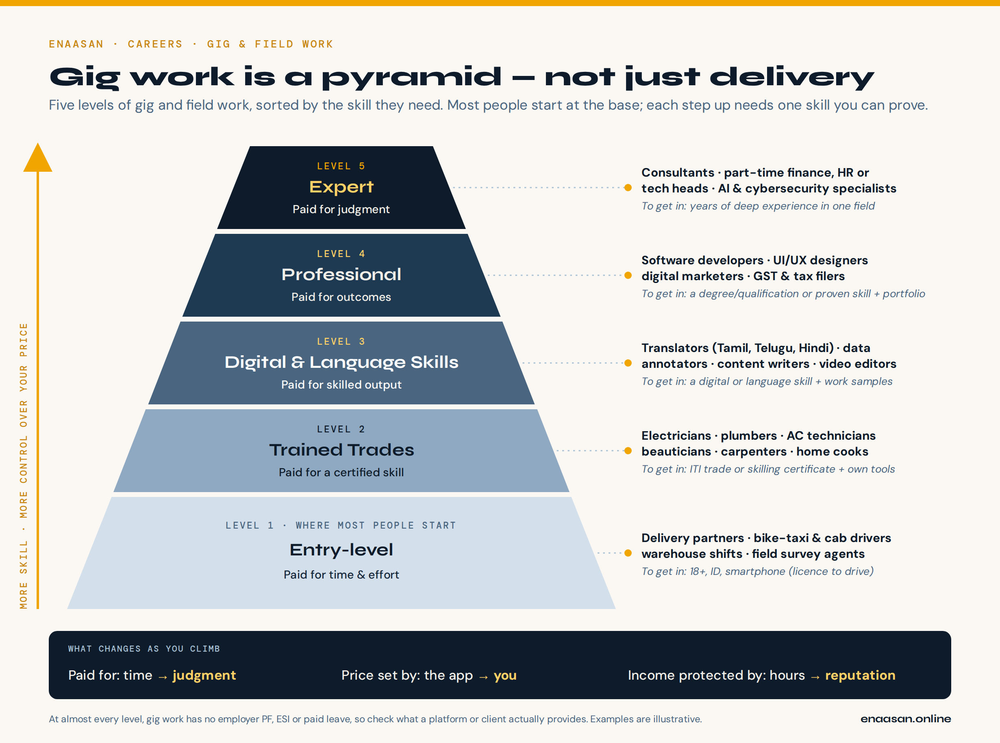

# Need Money Now? How to Use Gig Work Without Losing Your Plan

You've finished 12th, a diploma or a degree. You've moved to a new city or town. Rent is due, and the right job hasn't come yet — or you're preparing for an exam or course and need income that fits around it. Gig work can help. This guide shows how to use it well, and how to make sure it stays a stepping stone.

> **The short answer:** Gig work can start paying you within days, and you choose your hours. Use it well by doing three things: enter at the **highest level** your skills allow, **protect the time** you set aside for your real goal, and **build one skill** that moves you up. It turns into a trap only when it quietly eats that time.

## Is this guide for you?

It is, if you are 18 or older and one of these sounds like you:

- **"I've just moved and I need money this month."** You came to a city for a job search, a course, or family reasons, and you need rent and food money before anything else works out.
- **"I'm still figuring out my career."** You don't want to grab the first full-time job out of panic and get stuck in it.
- **"I'm preparing for something else."** A government exam, an entrance test, a course, a skill — and you need income that bends around your preparation, not the other way round.

Most gig platforms require you to be at least 18. Riding and driving work also needs a valid driving licence.

## Gig work is a pyramid, not just delivery

When most people hear "gig work", they picture a delivery bag or a bike taxi. That is real work — but it is only the base.

*Phone version: `../../../assets/diagrams/gig-work-skill-pyramid-portrait.png`*

Gig work has five levels, sorted by the skill it needs:

1. **Entry-level** — paid for time and effort (delivery, bike-taxi and cab driving, warehouse shifts, field surveys)
2. **Trained trades** — paid for a certified skill (electrician, plumber, AC technician, beautician)
3. **Digital and language skills** — paid for skilled output (translation, data annotation, content writing, online tutoring)
4. **Professional** — paid for outcomes (software, design, digital marketing, GST and tax filing)
5. **Expert** — paid for judgment (consultants, specialists)

As you climb, three things change: you are paid for judgment instead of time, **you** set the price instead of the app, and your reputation — not your hours — protects your income.

## Which level can you enter this week?

Start from what you already have.

| If you have… | You can usually start at… | Worth trying on the side |
|---|---|---|
| **12th pass** | Level 1 — delivery, riding, warehouse or field work | Level 3, if you are strong in a language (translation, transcription in your mother tongue) or comfortable on a computer |
| **ITI or diploma** | Level 2 — work in your own trade (electrical, mechanical, AC, plumbing). Your certificate is your entry ticket | Level 3 digital tasks, if you have the skills |
| **Graduate** | Level 3 — content, data work, tutoring in your subject | Level 4, if your degree is professional (B.Com → bookkeeping and GST support; BCA/B.Tech → web work; design) and you can show samples |

> **Honest note:** Level 1 pays the fastest — you can often start within days and get paid weekly. Higher levels usually take longer to land the first client. That's why many people do both: Level 1 for cash now, and a Level 3 skill built on the side. That combination is the stepping stone in action.

## Before your first shift: what you'll need

- [ ] **Aadhaar** and **PAN**
- [ ] A **bank account in your name**, with UPI — payouts go here
- [ ] A **smartphone** with a reliable data plan
- [ ] For riding or driving: **driving licence**, vehicle **RC** and **insurance**
- [ ] For trades: your **ITI or diploma certificate**, and basic tools
- [ ] For digital work: an **email ID** and two or three **samples** of your work
- [ ] Your current **address details** in the new city — many platforms run a background check before you start

Requirements differ between platforms and cities. Check the platform's official app or website — not a WhatsApp forward.

## Read the earnings claim honestly

Ads say "earn up to…". The words *up to* describe the best week of the best earners — not a normal week.

**Work out your real hourly earning:**

> **Real hourly earning** = (money received in the week − fuel − vehicle costs − phone and data − any platform fees or rentals) ÷ **all the hours you were logged in, including waiting time**

Ask before you join:

- Is the "up to" figure based on full-time hours, peak hours, or weekends only?
- Are incentives tied to targets — a number of orders or trips — that you may not reach?
- Who pays for fuel, repairs, and a damaged phone?
- How often do payouts come — daily or weekly?
- Is there a deposit for a bag, uniform or kit? Is it refundable?

Track your real hourly earning for **two weeks** before you decide whether a platform is worth it.

## Protect your time (the part-time rule)

If gig work is meant to support your real goal, your real goal gets scheduled first.

1. **Set your weekly hour limit before you log in.** Decide it on Sunday, not in the middle of a busy shift.
2. **Block your study, course or job-search hours first.** Gig hours fill the gaps around them — never the other way round.
3. **Pick your shifts on purpose.** Busy hours — mealtimes, evenings, weekends — often pay better on many apps. Check they don't clash with the hours your mind is sharpest for study.
4. **Watch for targets that keep you logged in.** "Complete a few more orders to unlock your bonus" is designed to extend your shift. Sometimes it's worth it; decide deliberately.
5. **Rest.** Riding tired is dangerous. No payout is worth an accident.

## Your safety net: set it up in week one

Gig work usually comes **without** what a salaried job gives you — no PF, no ESI, no paid leave. You have to build your own safety net. Start with these:

- **Ask what the platform covers.** Many offer some accident or health insurance. Read what it actually covers and how you claim it.
- **Register on e-Shram** (eshram.gov.in) — the government's registry for unorganised workers. The Union Budget 2025–26 announced e-Shram registration and Ayushman Bharat (PM-JAY) health cover for platform workers. Check the portal for what is live now and whether you qualify.
- **Get low-cost accident insurance.** Under Pradhan Mantri Suraksha Bima Yojana (PMSBY), a savings-account holder aged 18–70 can get accident cover for a small yearly premium, auto-debited from the account. Ask your bank.
- **Know your state's law.** Several states — including Rajasthan, Karnataka and Telangana — have passed laws for gig-worker welfare. What they offer, and how far they are working on the ground, varies.
- **Build a small emergency fund.** Even a little saved each week helps when the bike breaks down or work goes slow.
- **Don't take a vehicle loan just to start.** Try the work for a few weeks first. A loan turns a flexible job into one you can't leave.

## Stepping stone or trap? Your 90-day check

Ninety days after you start, sit down and answer honestly.

**It's working as a stepping stone if:**

- You're covering your costs and saving at least a little
- Your study, course or job search is on track
- You've started building one skill for the next level

**It's becoming a trap if:**

- Months have passed and you haven't started any new skill
- You're working more hours just to earn the same money
- Your preparation time keeps shrinking
- You've taken on debt for the job

If it's becoming a trap, you don't have to quit. Change one thing: cut the hours, or book the course. Each step up needs one skill you can prove:

- **Level 1 → 2:** an ITI trade or a short government skilling course
- **Level 2 → 3:** a digital or language skill, plus work samples
- **Level 3 → 4:** deepen one skill to professional standard, or earn its qualification

## Watch out for scams

- **Never pay to get work.** A real platform does not charge a "registration fee" or "joining fee" to give you work.
- **Ignore "like videos and earn" and "rate hotels and earn" offers** on WhatsApp or Telegram. They start by paying small amounts and then ask you to "invest". That is a scam.
- **Never share an OTP**, your UPI PIN, or bank details with anyone who calls about a job.
- **Download apps only from the official app store**, and check the company name.
- **If you've been cheated,** call the national cybercrime helpline **1930** quickly, or report at **cybercrime.gov.in**.

## What to do next

1. **Place yourself on the pyramid.** Which level can you enter this week? Which level is next?
2. **Before you sign up anywhere,** ask the five earnings questions above.
3. **This week,** set your hour limit and block your study hours first.
4. **In week one,** register on e-Shram and check your insurance.
5. **Start the next skill.** If Level 3 or 4 is your target, strong communication gets you clients — start with Enaasan's communication skills guide. If you're working towards a full-time job, read *How to Get Your First Job*.
6. **Put your 90-day check in your phone calendar today.**

## Sources and verification

Rules, schemes, eligibility and platform terms change. Verify important decisions with the official source:

- **e-Shram registration and platform-worker benefits:** eshram.gov.in; Ministry of Labour and Employment (labour.gov.in)
- **PMSBY accident insurance:** jansuraksha.gov.in, or your bank
- **State gig-worker laws:** your state labour department; PRS Legislative Research (prsindia.org)
- **Cyber fraud:** helpline 1930; cybercrime.gov.in
- **Background:** NITI Aayog, *India's Booming Gig and Platform Economy* (June 2022)

*Enaasan informs decisions; it does not make them. This guide does not recommend any specific platform.*
